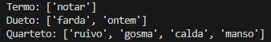
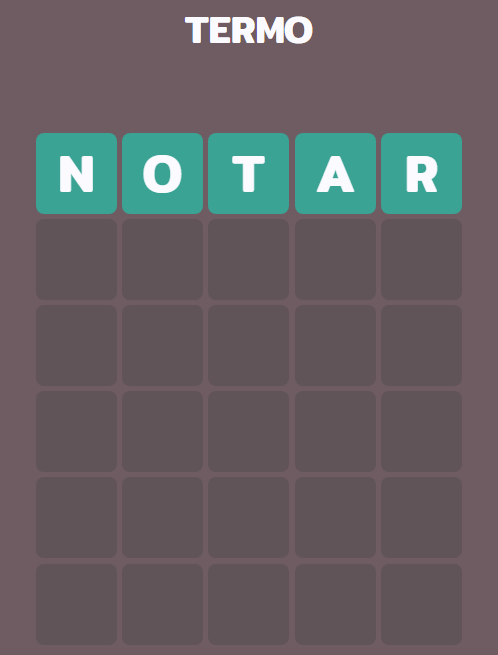
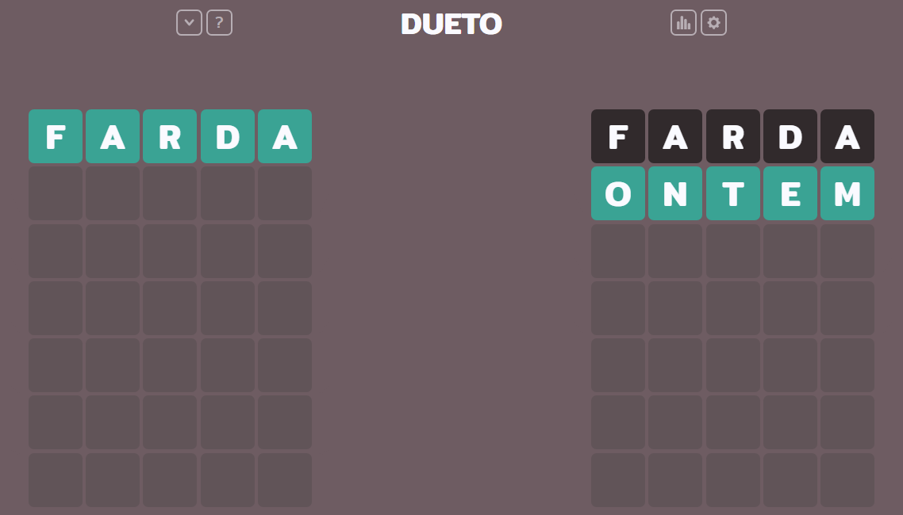
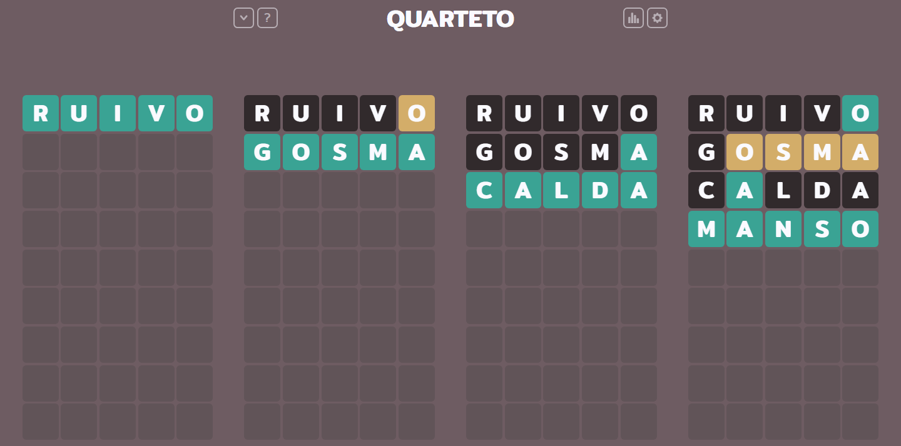

# Termo-Solver
Um trecho de código em Python feito como um exemplo de engenharia reversa para decodificar as respostas do jogo Termo (https://term.ooo/), utilizando apenas informações encontradas no código frontend do website.

## Explicação do código
O objetivo do jogo é adivinhar a palavra dadas as dicas fornecidas e várias tentativas. Funciona com uma lista de palavras, da qual um grupo de palavras é atualizado como resposta diariamente.

Através da análise do código-fonte, identificou-se que o jogo opera inteiramente no frontend, sem requisições de validação ao backend. Nota-se, também, que a lógica do código do jogo depende inteiramente de cálculo temporal. O Modo Termo (partida com apenas uma palavra) depende, assim como todos outros, da diferença de tempo entre um dia configurado como base e o dia atual (no fuso horário de São Paulo), além de outro cálculo envolvendo o tamanho da lista e a quantidade de respostas necessárias no modo.

Não obstante a similaridade, para a escolha de palavras nos modos Dueto e Quarteto (de duas e quatro palavras, respectivamente), são utilizadas duas strings previamente codificadas em Base64 para cada uma das situações. Uma vez decodificadas, têm seus elementos iterados e utilizados como índice para a lista de palavras. Assim, todos modos obtêm seus resultados, em um processo matemático inteiramente reproduzível sem acesso ao servidor.

O script termo.py desenvolvido leva em consideração e replica todos esses fatores para obter as respostas. Os nomes das variáveis no script foram mantidos propositalmente próximos aos encontrados no código JavaScript original do website para estabelecer um paralelismo e facilitar a rastreabilidade da lógica aplicada.

Adicionalmente, foi elaborada outra versão utilizando Playwright, para facilitar a obtenção das palavras com injeção de script, sem a necessidade de entender o processo matemático. O código injetado no ambiente JavaScript monitora a criação de qualquer objeto que utilize a propriedade "solution". Ao detectar esse gatilho, redefine o comportamento da propriedade, para a atribuição dessa variável ser interceptada e armazenada em uma variável auxiliar no objeto, sem causar recursão infinita.

## Exemplo
Teste realizado no dia 1 de janeiro de 2026

### Previsão do dia

### Resultados
  

## Considerações finais
Apesar de sua eficiência e de apresentar funcionamento simples e compreensível, o método matemático não possui resiliência para mudanças futuras na lógica do código. O script utilizando Playwright serve como *fallback* para mais consistência e facilidade em encontrar a solução. Devido à modularidade do script, a extração dinâmica de dados diretamente da memória do navegador foi substituída em favor de injeção de script. Apesar da robustez do playwright, torna o processo menos eficiente, e persiste a possibilidade de o código estar sujeito à necessidade de intervenção manual do usuário para identificar as variáveis corretas, dada a possibilidade de mudanças de nomes de variáveis e ofuscações do código.

Embora não esteja no escopo deste projeto, vale ressaltar que a lógica implementada em termo.py permite prever as respostas de datas futuras com modificações mínimas, devido à natureza determinística do processo de geração de palavras.